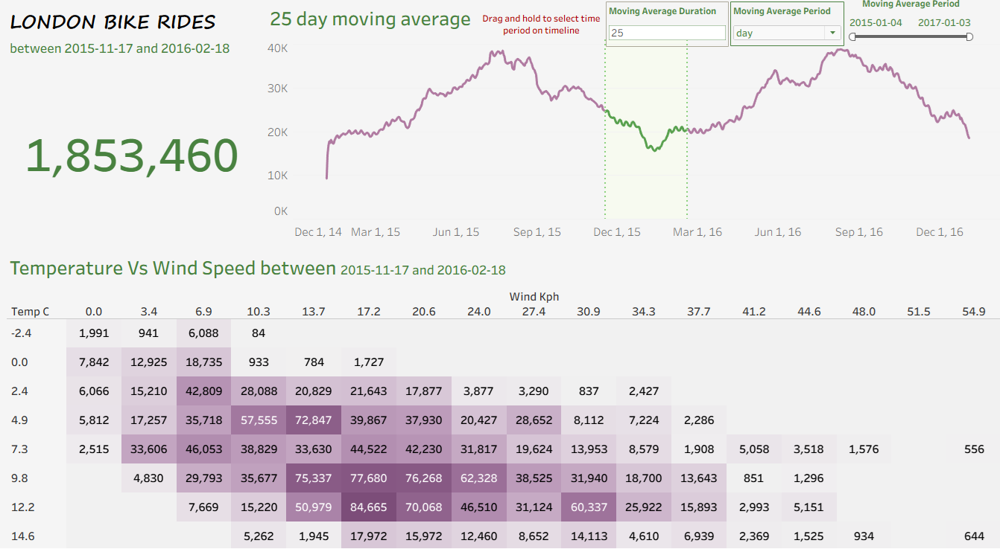

# 🚲 London Bike Rides — Tableau Dashboard

> **Interactive Data Analytics & Business Intelligence Project**

An end-to-end data analytics project using the **London Bike Sharing dataset** to analyze bike rental trends, identify seasonal patterns, and explore the relationship between bike usage and weather conditions.

The project combines **Python, Pandas, Excel, and Tableau** to transform raw data into an interactive business intelligence dashboard with dynamic time-series analysis and weather-based visualizations.

---

## 📊 Project Overview

The London bike-sharing system generates large volumes of operational data that can be used to understand demand patterns and identify factors that influence bike usage.

The objective of this project was to develop an **interactive Tableau dashboard** that enables users to:

* Analyze bike rental activity over time
* Identify seasonal and demand patterns
* Smooth daily fluctuations using a dynamic moving average
* Examine the relationship between temperature, wind speed, and bike usage
* Interactively explore trends using Tableau parameters
* Present complex data through an intuitive business intelligence dashboard

---

## 🎯 Business Questions

This project focuses on answering the following questions:

1. **How does bike rental demand change over time?**
2. **What seasonal patterns can be observed in bike usage?**
3. **How does applying a moving average change the interpretation of rental trends?**
4. **How are temperature and wind speed associated with bike rental activity?**
5. **How can interactive Tableau features improve exploratory data analysis?**

---

## 🛠️ Tools & Technologies

| Technology     | Purpose                                      |
| -------------- | -------------------------------------------- |
| **Python**     | Data preparation and transformation          |
| **Pandas**     | Data cleaning and manipulation               |
| **Kaggle API** | Dataset acquisition                          |
| **Excel**      | Prepared dataset storage                     |
| **Tableau**    | Data visualization and dashboard development |

---

## 🔄 Project Workflow

```text
Raw Dataset
     ↓
Data Acquisition
     ↓
Data Exploration
     ↓
Data Cleaning & Transformation
     ↓
Prepared Excel Dataset
     ↓
Tableau Data Connection
     ↓
Calculated Fields & Parameters
     ↓
Interactive Visualizations
     ↓
Dashboard
     ↓
Business Insights
```

---

# 📈 Dashboard

The final Tableau dashboard combines high-level KPIs, time-series analysis, dynamic moving averages, and weather-condition analysis.

### Key Dashboard Components

#### 1. Total Bike Rides

The dashboard provides a high-level KPI showing:

**1,853,460 Total Bike Rides**

This gives users an immediate understanding of the overall scale of bike-sharing activity represented in the dataset.

---

#### 2. Bike Rides Trend

A time-series line chart tracks bike rental activity across the available period.

This visualization makes it possible to identify:

* Periods of increasing demand
* Periods of declining demand
* Seasonal fluctuations
* Short-term volatility
* Longer-term rental trends

---

#### 3. Dynamic Moving Average

A major feature of the dashboard is the **user-controlled moving average**.

Users can modify the moving-average duration through Tableau parameters.

For example:

```text
Moving Average Duration: 25 Days
Moving Average Period: Day
```

The moving average reduces daily fluctuations and provides a clearer representation of the underlying rental trend.

### Why this matters

Daily bike rentals can be highly variable. A moving average helps distinguish **short-term noise from longer-term demand patterns**.

The interactive parameter also allows users to compare different smoothing periods rather than relying on a single predefined calculation.

---

#### 4. Temperature vs. Wind Speed Heatmap

The dashboard includes a heatmap analyzing bike rental activity across different combinations of:

* **Temperature (°C)**
* **Wind Speed (kph)**

The cell values represent the number of bike rides recorded under each combination of environmental conditions.

This visualization provides a multidimensional view of how weather conditions correspond with bike-sharing demand.

---

# 🔍 Key Insights

### 📌 1. Bike demand varies significantly over time

The time-series analysis shows substantial variation in daily bike rental activity, demonstrating that demand is not consistent throughout the year.

### 📌 2. Seasonal patterns are evident

Bike usage follows noticeable seasonal fluctuations, with periods of higher and lower rental activity.

This suggests that factors such as weather and seasonality can play an important role in bike-sharing demand.

### 📌 3. Moving averages reveal underlying trends

Daily rental data contains considerable short-term variation.

Applying a moving average makes broader trends easier to identify by reducing the effect of daily fluctuations.

The ability to change the moving-average period also allows users to examine the data at different levels of granularity.

### 📌 4. Weather conditions are associated with bike usage

The temperature and wind-speed heatmap demonstrates variation in bike rental activity across different environmental conditions.

Higher concentrations of rides occur under certain combinations of temperature and wind speed, while less favorable conditions correspond with lower levels of activity.

### 📌 5. Interactive dashboards improve exploratory analysis

The use of Tableau parameters allows users to control the analysis rather than simply viewing static visualizations.

This makes the dashboard more useful for **exploration, comparison, and trend analysis**.

---

# 💡 Business Value

Understanding bike rental demand can help bike-sharing operators make more informed decisions around:

* 🚲 Bike availability
* 📍 Resource allocation
* 🔧 Maintenance planning
* 📅 Seasonal preparation
* 📊 Demand forecasting
* 🌦️ Weather-sensitive operations

Although this project focuses primarily on descriptive analytics, the insights provide a foundation for future **predictive demand forecasting and operational optimization**.

---

# 🧮 Analytical Techniques

The project demonstrates practical application of:

* Data Cleaning
* Data Transformation
* Exploratory Data Analysis
* Time-Series Analysis
* Moving Average Analysis
* Parameter-Driven Analysis
* Heatmap Analysis
* KPI Development
* Interactive Dashboard Design
* Data Storytelling

---

# 🖥️ Dashboard Features

| Feature                   | Description                                            |
| ------------------------- | ------------------------------------------------------ |
| **KPI**                   | Displays total bike rides                              |
| **Time-Series Chart**     | Tracks rental activity over time                       |
| **Moving Average**        | Smooths daily fluctuations                             |
| **Dynamic Parameter**     | Allows users to change the moving-average period       |
| **Heatmap**               | Analyzes temperature and wind speed against bike usage |
| **Interactive Dashboard** | Combines multiple analytical views                     |

---

# 📁 Project Structure

```text
London-Bike-Rides/
│
├── data/
│   └── london_bikes_final.xlsx
│
├── tableau/
│   └── london_bike_rides_dashboard.twbx
│
├── images/
│   └── london_bike_dashboard.png
│
├── notebooks/
│   └── london_bikes_analysis.ipynb
│
└── README.md
```

> **Note:** Update the file names and folder structure above to match the actual files in your repository.

---

# 📸 Dashboard Preview

Add the dashboard screenshot to your repository's `images` folder and display it here:

```markdown

```

---

# 🚀 Project Outcome

This project demonstrates an end-to-end approach to transforming raw operational data into an **interactive business intelligence solution**.

Using Python and Pandas for data preparation and Tableau for visualization, the project converts the London Bike Sharing dataset into an analytical dashboard that enables users to explore:

**Bike Demand → Time Trends → Seasonal Patterns → Moving Averages → Weather Relationships**

The project demonstrates my ability to work across the complete analytics workflow, from **data preparation and exploratory analysis to dashboard development and business insight generation**.

---

# 📚 Skills Demonstrated

**Data Analytics**

`Data Cleaning` · `Data Transformation` · `EDA` · `Time-Series Analysis` · `Business Analysis`

**Visualization & BI**

`Tableau` · `Dashboard Design` · `Calculated Fields` · `Parameters` · `Heatmaps` · `KPIs`

**Programming & Data Tools**

`Python` · `Pandas` · `Excel` · `Kaggle API`

---

## 👤 Author

**EmmAnalyitics**

Data Analyst | Business Intelligence | Data Visualization | Python | SQL | Tableau | Power BI

---

### ⭐ If you find this project useful, feel free to explore the repository and connect with me.
